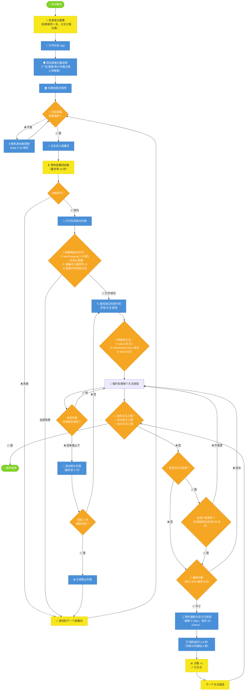

# 抖音直播间自动关注脚本 — 功能逻辑图



---

## 🔄 核心数据流

```
┌──────────────┐     ┌──────────────┐     ┌──────────────┐
│  配置存储     │     │  反检测工具   │     │  控件选择器   │
│  follower-   │◄────│  anti-       │     │  widget.js   │
│  Config.js   │     │  Detection   │     │              │
└──────┬───────┘     └──────┬───────┘     └──────┬───────┘
       │                    │                    │
       ▼                    ▼                    ▼
┌──────────────────────────────────────────────────────┐
│               liveRoomFollower.js                     │
│                                                       │
│  main() → while(未达到上限) → {                       │
│    if (在直播间) → doLiveRoomFollow()                 │
│    else → swipe()                                     │
│  }                                                    │
│                                                       │
│  doLiveRoomFollow():                                  │
│    1. enter live room                                 │
│    2. openViewerList()  ←── 3 strategies              │
│    3. processViewerList() ←── while + scroll + follow │
│    4. closeViewerList()                               │
│    5. swipe to next room                              │
│  }                                                    │
└──────────────────────────────────────────────────────┘
       │
       ▼
┌──────────────┐
│  原项目基础设施 │
│  util.js      │
│  openApp.js   │
│  douyinUtils  │
│  closePopup   │
└──────────────┘
```

---

## ⏱️ 反检测时间线

```
进入直播间            打开观众列表            关注第1人             关注第2人             切换直播间
   │                     │                     │                    │                    │
   ├── sleep 2-5s ──────┤                     │                    │                    │
   │                     ├── sleep 2s ────────┤                    │                    │
   │                     │                     ├─ sleep 3-8s ──────┤                    │
   │                     │                     │                    ├─ sleep 3-8s ───────┤
   │                     │                     │                    │                    ├─ sleep 1.5s ──→
   │                     │                     │                    │                    │
   ▼                     ▼                     ▼                    ▼                    ▼
  随机偏移              随机偏移              随机偏移             随机偏移             贝塞尔曲线
  5-30px                5-30px                5-30px               5-30px               +随机速度
```

---

## 📊 关键配置项及作用

| 配置 | 默认值 | 作用 |
|------|--------|------|
| 关注间隔 | 3-8 秒 | 每次关注后随机等待，太快会被风控 |
| 点击偏移 | 5-30px | 不点固定坐标，模拟人手 |
| 单次上限 | 20 人 | 一次执行最多关注数 |
| 单日上限 | 80 人 | 一天最多关注数，防止封号 |
| 关注概率 | 90% | 不是每个符合条件的都关注，留 10% 容错 |
| 滚动次数 | 3 次 | 每个直播间最多翻 3 次列表 |
